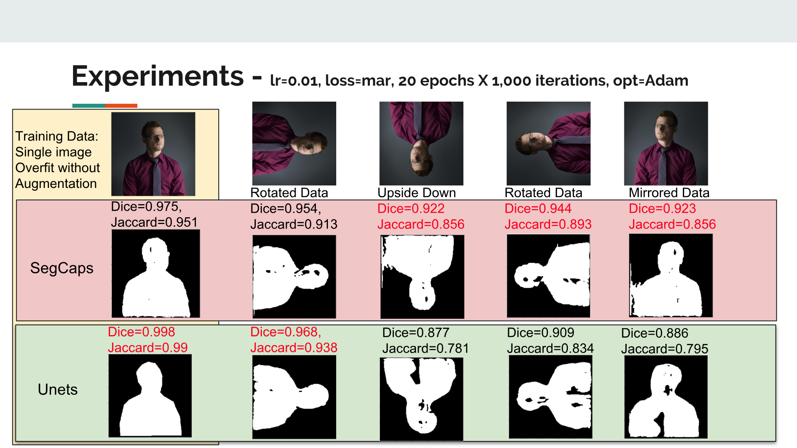
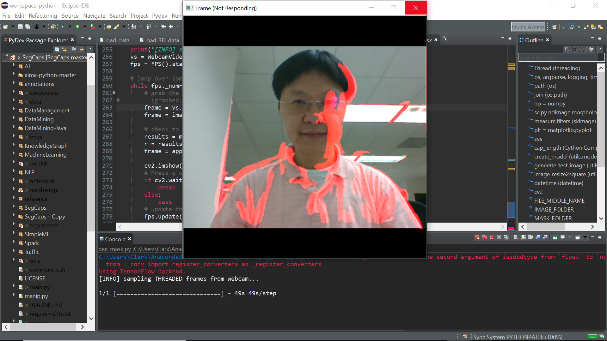

# Capsules for Object Segmentation (SegCaps)
### by [Rodney LaLonde](https://rodneylalonde.wixsite.com/personal) and [Ulas Bagci](http://www.cs.ucf.edu/~bagci/)

### Modified by [Cheng-Lin Li](https://cheng-lin-li.github.io/about/)
### Objectives: Build up an End-to-End pipeline for Object Segmentation experiments on SegCaps with not only 3D CT images (LUNA 16) but also 2D color images (MS COCO 2017).

## This repository downloaded from the implementation of SegCaps from official site with program restructure and enhancements.

The original paper for SegCaps can be found at https://arxiv.org/abs/1804.04241.

The original source code can be found at https://github.com/lalonderodney/SegCaps

Author's project page for this work can be found at https://rodneylalonde.wixsite.com/personal/research-blog/capsules-for-object-segmentation.


## Getting Started Guide

[This is the presentation file for this project.](http://bit.ly/2N7aWti)

This is my experiment to test SegCaps Net R3.
I overfit on a single image, then tested how the modeled performed as the image orientation was changed. 

Pre-trained weights include in 'data/saved_models/segcapsr3/split-0_batch-1_shuff-1_aug-0_loss-mar_slic-1_sub--1_strid-1_lr-0.01_recon-20.0_model_20180723-235354.hdf5'

## Enhancements & Modifications

1. The program was modified to support python 3.6 on Ubuntu 18.04 and Windows 10.
2. Support not only 3D computed tomography scan images but also 2D Microsoft Common Objects in COntext (MS COCO) dataset images.
3. Change the dice loss function type from Sørensen to Jaccard coefficient for comparing the similarity
4. Add Kfold parameter for users to customize the cross validation task. K = 1 will force model to perform overfit.
5. Add retrain parameter to enable users to reload pre-trained weights and retrain the model.
6. Add initial learning rate for users to adjust.
7. Add steps per epoch for users to adjust.
8. Add number of patience for early stop of training to users.
9. Add 'bce_dice' loss function as binary cross entropy + soft dice coefficient.
10. Revise 'train', 'test', 'manip' flags from 0 or 1 to flags show up or not to indicate the behavior of main program.
11. Add new webcam integration program for video stream segmentation.

## Procedures 

### 1. Download this repo to your own folder
  1-1. Download this repository via [https://github.com/Cheng-Lin-Li/SegCaps/archive/master.zip](https://github.com/Cheng-Lin-Li/SegCaps/archive/master.zip)

  1-2. Extract the zip file into a folder.

  1-3. Change your current directory to project folder.

  ```bash
  cd ./SegCaps-master/SegCaps-master
  ```

### 2. Install Required Packages on Ubuntu / Windows
This code is written for Keras using the TensorFlow backend. 
The requirements.txt will install tensorflow CPU as default. You may need to adjust requirements.txt file according to your environment (CPU only or GPU for tensorflow installation). 

Please install all required packages before using programs.

```bash
pip install -r requirements.txt
```
### You may need to install additional library in Ubuntu version 17 or above version.
If you get the following error:
```text
ImportError: libjasper.so.1: cannot open shared object file: No such file or directory
```
These steps will resolve it:
```bash
sudo apt-get update
sudo apt-get install libjasper-dev
```

### 3. Make your data directory.
Below commands:

  3-1. Create root folder name 'data' in the repo folder. All models, results, etc. are saved to this root directory.

  3-2. Create 'imgs' and 'masks' folders for image and mask files. 

  3-3. If you would like to leverage the data folder which come from this repo, then leave the repo as is.

```bash
mkdir data
chmod 755 data
cd ./data
mkdir imgs
mkdir masks
chmod 755 *
cd ..
```

### 4. Select Your dataset

#### 4-1. Test the result on original LUNA 16 dataset.
  1. Go to [LUng Nodule Analysis 2016 Grand-Challenges website](https://luna16.grand-challenge.org/)
  2. Get an account by registration.
  3. Join the 'LUNA 16' challenge by click 'All Challenges' on the tab of top. Click the 'Join' and goto 'Download' section to get your data.
  4. copy your image files into BOTH ./data/imgs and ./data/masks folders.

#### 4-2. Test on Microsoftsoft Common Objects in COntext (MS COCO) dataset 2017.
The repo include a crawler program to download your own class of images for training.
But you have to download the annotation file first.

 Click [Microsoft COCO 2017](http://images.cocodataset.org/annotations/annotations_trainval2017.zip) to download it.

There are two JSON files contain in the zip file. Extract them into a folder.

In this example, these two annotation files were extracted into the folder ~/SegCaps/annotations/

Example 1: Download 10 images and mask files with 'person' class from MS COCO validation dataset.

```bash
cd ./cococrawler
$python3 getcoco17.py --data_root_dir ../data --category person --annotation_file ./annotations/instances_val2017.json --number 10
```

Example 2: Download image IDs 22228, and 178040 with mask images for only person class from MS COCO 2017 training dataset.
```bash
cd ./cococrawler
$python3 getcoco17.py --data_root_dir ../data/coco --category person --annotation_file ./annotations/instances_train2017.json  --number 10 --id 22228 178040
```

You can choose multiple classes if you want. Just specify category of each class by space. 

Example: --category person dog cat


Try below command to list all parameters for the crawler program.

```bash
python3 getcoco17.py -h
```

```text
usage: getcoco17.py [-h] [--data_root_dir DATA_ROOT_DIR]
                    [--category CATEGORY [CATEGORY ...]]
                    [--annotation_file ANNOTATION_FILE]
                    [--resolution RESOLUTION] [--id ID [ID ...]]
                    [--number NUMBER]

Download COCO 2017 image Data

optional arguments:
  -h, --help            show this help message and exit
  --data_root_dir DATA_ROOT_DIR
                        The root directory for your data.
  --category CATEGORY [CATEGORY ...]
                        MS COCO object categories list (--category person dog
                        cat). default value is person
  --annotation_file ANNOTATION_FILE
                        The annotation json file directory of MS COCO object
                        categories list. file name should be
                        instances_val2017.json
  --resolution RESOLUTION
                        The resolution of images you want to transfer. It will
                        be a square image.Default is 0. resolution = 0 will
                        keep original image resolution
  --id ID [ID ...]      The id of images you want to download from MS COCO
                        dataset.Number of images is equal to the number of
                        ids. Masking will base on category.
  --number NUMBER       The total number of images you want to download.
```


### 5. Train your model
#### 5-1 Main File

From the main file (`main.py`) you can train, test, and manipulate the segmentation capsules of various networks. Simply set the ```--train```, ```--test```, or ```--manip flags``` to turn these on respectively. The argument ```--data_root_dir``` is the only required argument and should be set to the directory containing your 'imgs' and 'masks' folders. There are many more arguments that can be set and these are all explained in the main.py file. 

Please be aware of manipulate function only support 3D images. This version of source codes *DO NOT* support 2D images.


The program will convert all image files into numpy format then store training/testing images into ./data/np_files and training (and testing) file lists under ./data/split_list folders. You need to remove these two folders every time if you want to replace your training image and mask files. The program will only read data from np_files folders.

#### 5-2 Train your model:

The program uses KFold cross-training and testing, and K = 4 as default. If your testing image files less than 4, please indicate the number of image files you have.

Example: You have only 2 images, and you indicate --Kfold 2, which means you will use 1 image file for training, and 1 image file for testing.

#### Example command: Train SegCaps R3 on MS COCO dataset without GPU support. Assume you have 4 or more images.

```bash
python3 ./main.py --train --initial_lr 0.1 --net segcapsr3 --loss dice --data_root_dir=data --which_gpus=-2 --gpus=0 --dataset mscoco17 
```

#### Example command: Train basic Capsule Net on MS COCO dataset with GPU support. Number of GPU = 1. K = 1 = You only train your model on one image for overfitting test.

```bash
python3 ./main.py --train --data_root_dir=data --net capsbasic --initial_lr 0.0001 --loglevel 2 --Kfold 1 --loss dice --dataset mscoco17 --recon_wei 20 --which_gpu -1 --gpus 1 --aug_data 0
```

#### 5-3 Test your model:

For testing you will also have to specify the number of Kfolds as above if you
have fewer than 4 images.

Again, the program will convert all image files into numpy format and store training/testing images into ./data/np_files and testing (and training) file lists under ./data/split_list folders. You need to remove these two folders every time if you want to replace your training image and mask files.  The program will only read data from np_files folders.

Example: You have only 2 images, and you indicate --Kfold 2, which means you will use 1 image file for training, and 1 image file for testing.

#### Example command: Test SegCaps R3 on MS COCO dataset without GPU support. Your pre-trained weight file store on ./data/saved_models/segcapsr3/split-0_batch-1_shuff-1_aug-1_loss-dice_slic-1_sub--1_strid-1_lr-0.01_recon-2.0_model_20180702-055808.hdf5

```bash
python3 ./main.py --test --Kfold 2 --net segcapsr3 --data_root_dir=data --loglevel 2 --which_gpus=-2 --gpus=0 --dataset mscoco17 --weights_path data/saved_models/segcapsr3/split-0_batch-1_shuff-1_aug-1_loss-dice_slic-1_sub--1_strid-1_lr-0.01_recon-2.0_model_20180702-055808.hdf5
```

#### 5-4 List all parameters:

Try below command to list all parameters for the main program.

```bash
python3 main.py -h
```

And the result will be:

```text
usage: main.py [-h] --data_root_dir DATA_ROOT_DIR
               [--weights_path WEIGHTS_PATH] [--split_num SPLIT_NUM]
               [--net {segcapsr3,segcapsr1,capsbasic,unet,tiramisu}] [--train]
               [--test] [--manip] [--shuffle_data {0,1}] [--aug_data {0,1}]
               [--loss {bce,w_bce,dice,bce_dice,mar,w_mar}] [--batch_size BATCH_SIZE]
               [--initial_lr INITIAL_LR] [--steps_per_epoch STEPS_PER_EPOCH]
               [--epochs EPOCHS] [--patience PATIENCE] [--recon_wei RECON_WEI]
               [--slices SLICES] [--subsamp SUBSAMP] [--stride STRIDE]
               [--verbose {0,1,2}] [--save_raw {0,1}] [--save_seg {0,1}]
               [--save_prefix SAVE_PREFIX] [--thresh_level THRESH_LEVEL]
               [--compute_dice COMPUTE_DICE]
               [--compute_jaccard COMPUTE_JACCARD]
               [--compute_assd COMPUTE_ASSD] [--which_gpus WHICH_GPUS]
               [--gpus GPUS] [--dataset {luna16,mscoco17}]
               [--num_class NUM_CLASS] [--Kfold KFOLD] [--retrain {0,1}]
               [--loglevel LOGLEVEL]

Train on Medical Data or MS COCO dataset

optional arguments:
  -h, --help            show this help message and exit
  --data_root_dir DATA_ROOT_DIR
                        The root directory for your data.
  --weights_path WEIGHTS_PATH
                        /path/to/trained_model.hdf5 from root. Set to "" for
                        none.
  --split_num SPLIT_NUM
                        Which training split to train/test on.
  --net {segcapsr3,segcapsr1,capsbasic,unet,tiramisu}
                        Choose your network.
  --train               Add this flag to enable training.
  --test                Add this flag to enable testing.
  --manip               Add this flag to enable manipulation.
  --shuffle_data {0,1}  Whether or not to shuffle the training data (both per
                        epoch and in slice order.
  --aug_data {0,1}      Whether or not to use data augmentation during
                        training.
  --loss {bce,w_bce,dice,bce_dice,mar,w_mar}
                        Which loss to use. "bce" and "w_bce": unweighted and
                        weighted binary cross entropy, "dice": soft dice
                        coefficient, "bce_dice": binary cross entropy + soft dice coefficient, "mar" and "w_mar": unweighted and
                        weighted margin loss.
  --batch_size BATCH_SIZE
                        Batch size for training/testing.
  --initial_lr INITIAL_LR
                        Initial learning rate for Adam.
  --steps_per_epoch STEPS_PER_EPOCH
                        Number of iterations in an epoch.
  --epochs EPOCHS       Number of epochs for training.
  --patience PATIENCE   Number of patience indicates the criteria of early
                        stop training.If score of metrics do not improve
                        during the patience of epochs, the training will be
                        stopped.
  --recon_wei RECON_WEI
                        If using capsnet: The coefficient (weighting) for the
                        loss of decoder
  --slices SLICES       Number of slices to include for training/testing.
  --subsamp SUBSAMP     Number of slices to skip when forming 3D samples for
                        training. Enter -1 for random subsampling up to 5% of
                        total slices.
  --stride STRIDE       Number of slices to move when generating the next
                        sample.
  --verbose {0,1,2}     Set the verbose value for training. 0: Silent, 1: per
                        iteration, 2: per epoch.
  --save_raw {0,1}      Enter 0 to not save, 1 to save.
  --save_seg {0,1}      Enter 0 to not save, 1 to save.
  --save_prefix SAVE_PREFIX
                        Prefix to append to saved CSV.
  --thresh_level THRESH_LEVEL
                        Enter 0.0 for masking refine by Otsu algorithm. Or set
                        a value for thresholding level of masking. Value
                        should between 0 and 1.
  --compute_dice COMPUTE_DICE
                        0 or 1
  --compute_jaccard COMPUTE_JACCARD
                        0 or 1
  --compute_assd COMPUTE_ASSD
                        0 or 1
  --which_gpus WHICH_GPUS
                        Enter "-2" for CPU only, "-1" for all GPUs available,
                        or a comma separated list of GPU id numbers ex:
                        "0,1,4".
  --gpus GPUS           Number of GPUs you have available for training. If
                        entering specific GPU ids under the --which_gpus arg
                        or if using CPU, then this number will be inferred,
                        else this argument must be included.
  --dataset {luna16,mscoco17}
                        Enter "mscoco17" for COCO dataset, "luna16" for CT
                        images
  --num_class NUM_CLASS
                        Number of classes to segment. Default is 2. If number
                        of classes > 2, the loss function will be softmax
                        entropy and only apply on SegCapsR3** Current version
                        only support binary classification tasks.
  --Kfold KFOLD         Define K value for K-fold cross validate default K =
                        4, K = 1 for over-fitting test
  --retrain {0,1}       Retrain your model based on existing weights. default
                        0 = train your model from scratch, 1 = retrain
                        existing model. The weights file location of the model
                        has to be provided by --weights_path parameter
  --loglevel LOGLEVEL   loglevel 3 = debug, 2 = info, 1 = warning, 4 = error,
                        > 4 =critical

```

#### 5-5 Test your model on video stream:

Please note the segcapsr3 model is too big to load into the memory of Raspberry Pi R2/R3.
This program can be only executed on your laptop/desktop with webcam.

The segmentation task on segcapsr3 will take 45~50 seconds in a laptop without GPU support. The capsbasic net will take around 20 seconds. Although the program support 'ESC' or 'q' key press to terminate, you may need to terminate the console to close the program due to the latency of model inference time.

Example: Run the model segcapsr3 with pre-trained weight file without GPU at ./data/saved_models/segcapsr3/split-0_batch-1_shuff-1_aug-0_loss-dice_slic-1_sub--1_strid-1_lr-0.0001_recon-20.0_model_20180705-092846.hdf5

```bash
python3 gen_mask.py --weights_path data/saved_models/segcapsr3/split-0_batch-1_shuff-1_aug-0_loss-dice_slic-1_sub--1_strid-1_lr-0.0001_recon-20.0_model_20180705-092846.hdf5 --which_gpus=-2 --gpus=0 --net segcapsr3
```

This is the test result based on the pre-trained weight files 'data/saved_models/segcapsr3/split-0_batch-1_shuff-1_aug-0_loss-dice_slic-1_sub--1_strid-1_lr-0.0001_recon-20.0_model_20180705-092846.hdf5' which I included in the github.



Try below command to list all parameters for the main program.

```bash
python3 gen_mask.py -h
```

```text
usage: gen_mask.py [-h] [--net {segcapsr3,segcapsr1,capsbasic,unet,tiramisu}]
                   --weights_path WEIGHTS_PATH [--num_class NUM_CLASS]
                   [--which_gpus WHICH_GPUS] [--gpus GPUS]

Mask image by segmentation algorithm

optional arguments:
  -h, --help            show this help message and exit
  --net {segcapsr3,segcapsr1,capsbasic,unet,tiramisu}
                        Choose your network.
  --weights_path WEIGHTS_PATH
                        /path/to/trained_model.hdf5 from root. Set to "" for
                        none.
  --num_class NUM_CLASS
                        Number of classes to segment. Default is 2. If number
                        of classes > 2, the loss function will be softmax
                        entropy and only apply on SegCapsR3** Current version
                        only support binary classification tasks.
  --which_gpus WHICH_GPUS
                        Enter "-2" for CPU only, "-1" for all GPUs available,
                        or a comma separated list of GPU id numbers ex:
                        "0,1,4".
  --gpus GPUS           Number of GPUs you have available for training. If
                        entering specific GPU ids under the --which_gpus arg
                        or if using CPU, then this number will be inferred,
                        else this argument must be included.
```

#### 5-6 Pretrain weights for your testing:
##### Weights stored under your data folder.
   example: ./data/saved_models/segcapsr3
  
  1. Pretrained weights for general purpose on person with 40 images.

  split-0_batch-1_shuff-1_aug-0_loss-dice_slic-1_sub--1_strid-1_lr-0.0001_recon-20.0_model_20180705-092846.hdf5

  2. Pretrained weights for portrait of man. (Overfit test, not good at general purpose usage)

  split-0_batch-1_shuff-1_aug-0_loss-dice_slic-1_sub--1_strid-1_lr-0.01_recon-20.0_model_20180713-041900.hdf5

  3. Pretrained weights for 3 girls on the street (Overfit test, but still can test on general environments)

  split-0_batch-1_shuff-1_aug-0_loss-dice_slic-1_sub--1_strid-1_lr-0.01_recon-20.0_model_20180707-222802.hdf5


### 6. Program Descriptions
  1. main.py: The entry point of this project.
  2. train.py: The major training module.
  3. test.py: The major testing module.
  4. manip.py: The manipulate module of the model. Only support 3D images. This version does NOT support 2D images.
  5. gen_mask.py: A video streaming capture program integrated with SegCaps for segmentation task

### 7. Program Structures:
```text
----SegCaps-master  (Project folder)
    |
    \-cococrawler (Crawler program folder)
    |   \-annotations (Folder of Microsoft COCO annotation files)
    \-data  (The root folder of program output)
    |   \-imgs (Folder of training and testing images)
    |   \-masks (Folder of training and testing masking data)
    |   \-np_files (Folder to store processed image and mask files in numpy form.)
    |   \-split_lists (Folder for training and testing image splits list)
    |   \-logs (Training logs)
    |   \-plots (Trend diagram for Training period. Only generate after the training completed )
    |   \-figs (Conver image to numpy format, part of images stored for checking)
    |   \-saved_models (All model weights will be stored under this folder)
    |   \-results (Test result images will be stored in this folder)
    |     |
    |     \segcapr3\split_0\final_output
    |                      \raw_output
    |
    \-models (Reference model files: Unet and DenseNet)
    |
    \-segcapsnet (main modules for Capsule nets and SegCaps)
    |
    \-utils (image loader, loss functions, metrics, image augmentation, and thread safe models)
    |
    \-notebook (Some experiment notebooks for reference)
    |
    \-raspberrypi (Raspberry Pi software installation scripts) 
    |
    \-imgs (image file for this readme)
```

### 8. Install package on Raspberry Pi 2/3
### The section is under constructing. The SegCaps R3 model cannot fit into the memory of Raspberry Pi 2/3 so far.

The below description is for installing onto your Raspberry Pi environment.

#### Download tensorflow pre-compile version for ARM v7.
Tensorflow for ARM - Github Repo:
https://github.com/lhelontra/tensorflow-on-arm/releases

installation instructions.

https://medium.com/@abhizcc/installing-latest-tensor-flow-and-keras-on-raspberry-pi-aac7dbf95f2

#### OpenCV installation on Raspberry Pi 2/3
https://www.alatortsev.com/2018/04/27/installing-opencv-on-raspberry-pi-3-b/

There are two scripts under ./raspberrypi/
You can follow below steps to speed up the installation.
The while installation will take a very long time. It runs arround 1 day in the Raspberry Pi 2.

*** Please noted these scripts only tested on Raspberry Pi 2. But it should work on Pi 3***

```bash
cd ~/SegCaps/raspberrypi
chmod 755 *
./Raspi3-install.sh
```

Raspberry will reboot after the installation.

Execute second command.

```bash
cd ~/SegCaps/raspberrypi
./opencv-install.sh
```


## TODO List:
  1. Execute programs on LUNA 16 dataset. =>Completed

    1-1. Porting program from python 2.7 to 3.6 (Jun 11)

    1-2. Execute manipulation function. (Jun 11)

    1-2. Execute test function on one image without pre-trained weight(Jun 11)

    1-3. Execute train function on 3 images. (Jun 12)

    1-4. Execute test function on trained model (Jun 12)

    1-5. Display original image and result mask image. (Jun 12)

    1-6. Identify input image mask format. (Jun 14)

  2. Find right dataset for person/cat/dog segmentation. Candidate dataset is MS COCO. =>Completed

    2-1. Identify COCO stuff 2017 as target dataset. (Jun 15)

    2-2. Download annotation files for COCO 2017. (Jun 15)

  3. Test existing program on color images.=>Completed

    3-1. Generate single class mask on COCO masked image data.(Jun 13)

    3-2. Convert the image mask format to background=0, objects=1. (Jun 18)

    3-3. Convert the color image to gray scale image (Jun 18)

    3-3. Feed the color images with single classes mask to model for training. (Jun 21)

  4. Pipeline up:=>Completed

    4-1. Modify code to support experiments.(Jun 25)

      4-1-1. Models persistent by version with configuration and dataset. (Jun 26)

      4-1-2. Notebook folder build up to store experiment results.

    4-2. Test pipeline (Jun 27)

  5. Modify program for color images. =>Completed

  6. Model training =>Completed
    6-1. Enhance MSCOCO crawler to download image by IDs with specific class of image masking file. (Jun 28)
  
  7. Integrate model with webcam. =>Completed

  8. Modify the manipulate module to support 2D images.

  9. Reduce the model size to fit into Raspberry memory (1GB)

  10. Support multiclass segmentation.


### Citation

This project based on the official codebase of Capsules for Object Segmentation:
```
@article{lalonde2018capsules,
  title={Capsules for Object Segmentation},
  author={LaLonde, Rodney and Bagci, Ulas},
  journal={arXiv preprint arXiv:1804.04241},
  year={2018}
}
```

### Questions or Comments
For this modification version, please email me at clark.cl.li@gmail.com

For the original implementation, please direct any questions or comments to the author. You can either comment on the [project page](https://rodneylalonde.wixsite.com/personal/research-blog/capsules-for-object-segmentation), or email author directly at lalonde@knights.ucf.edu.


## Original README.md description:


## Condensed Abstract
Convolutional neural networks (CNNs) have shown remarkable results over the last several years for a wide range of computer vision tasks. A new architecture recently introduced by [Sabour et al., referred to as a capsule networks with dynamic routing](https://arxiv.org/abs/1710.09829), has shown great initial results for digit recognition and small image classification. Our work expands the use of capsule networks to the task of object segmentation for the first time in the literature. We extend the idea of convolutional capsules with *locally-connected routing* and propose the concept of *deconvolutional capsules*. Further, we extend the masked reconstruction to reconstruct the positive input class. The proposed convolutional-deconvolutional capsule network, called **SegCaps**, shows strong results for the task of object segmentation with substantial decrease in parameter space. As an example application, we applied the proposed SegCaps to segment pathological lungs from low dose CT scans and compared its accuracy and efficiency with other U-Net-based architectures. SegCaps is able to handle large image sizes (512 x 512) as opposed to baseline capsules (typically less than 32 x 32). The proposed SegCaps reduced the number of parameters of U-Net architecture by **95.4%** while still providing a better segmentation accuracy.

## Baseline Capsule Network for Object Segmentation


## SegCaps (R3) Network Overview


## Quantative Results on the LUNA16 Dataset

| Method           | Parameters | Split-0 (%) | Split-1 (%) | Split-2 (%) | Split-3 (%) | Average (%) |
|:---------------- |:----------:|:-----------:|:-----------:|:-----------:|:-----------:|:-----------:|
| U-Net            | 31.0 M     | 98.353      | 98.432      | 98.476      | **98.510**  | 98.449      |
| Tiramisu         | 2.3 M      | 98.394      | 98.358      | **98.543**  | 98.339      | 98.410      |
| Baseline Caps    | 1.7 M      | 82.287      | 79.939      | 95.121      | 83.608      | 83.424      |
| SegCaps (R1)     | **1.4 M**  | 98.471      | 98.444      | 98.401      | 98.362      | 98.419      |
| **SegCaps (R3)** | **1.4 M**  | **98.499**  | **98.523**  | 98.455      | 98.474      | **98.479**  |

## Results of Manipulating the Segmentation Capsule Vectors


